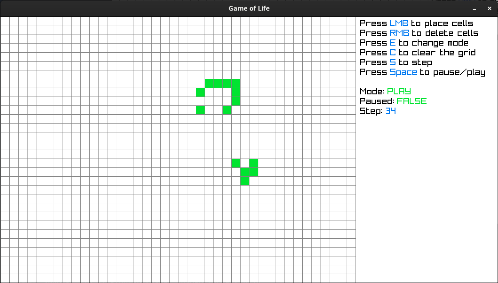

# cgol-raylib

A C implementation of [Conway's Game of Life](https://en.wikipedia.org/wiki/Conway%27s_Game_of_Life).



## Building

Make sure you have installed [raylib](https://github.com/raysan5/raylib?tab=readme-ov-file#build-and-installation).

```sh
# clone this repository
git clone https://github.com/abyucel/cgol-raylib cgol-raylib
cd cgol-raylib

# edit config.mk to match your system
make

# run the program
./cgol-raylib
```
